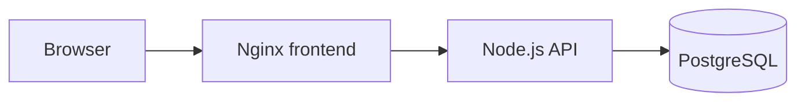

# Platform Hello

`platform-hello` is a small multi-tier hello-world application for the Senior Platform Engineer test.

It keeps the application simple so the platform work can focus on infrastructure as code, pipeline as code, policy as code, and documentation as code.

## Architecture

- `frontend`: static web UI served by Nginx.
- `backend`: Node.js REST API with health, message, and item endpoints.
- `database`: PostgreSQL database with a single `items` table.
- `docker-compose.yml`: local environment that runs all three tiers.



## Run Locally

Create a local `.env` file from `.env.example` and replace `POSTGRES_PASSWORD` with a local random value. Do not commit `.env`.

```bash
cp .env.example .env
docker compose up --build
```

Open:

- Frontend: `http://localhost:8080`
- Backend health: `http://localhost:3000/health`

## Test

```bash
node --test backend/test/app.test.js
```

## API

- `GET /health`: service status.
- `GET /api/message`: hello message.
- `GET /api/items`: list stored items.
- `POST /api/items`: create an item with JSON body `{"name":"example"}`.

## Test Assignment Mapping

- Task 0: this repository provides the multi-tier application codebase.
- Task 1: Terraform provisions AWS VPC, ALB, ECS Fargate, ECR, RDS PostgreSQL, Secrets Manager, S3, encrypted remote state, and DynamoDB locking for five environments.
- Task 2: GitHub Actions runs tests, image builds, Terraform validation, security scanning, common OPA checks, selected-environment OPA checks, ECR publishing, and gated deployments.
- Task 3: OPA policies enforce enterprise CI/CD baselines and per-environment deployment rules.
- Task 4: architecture, infrastructure, pipeline, policy, and documentation-as-code decisions are maintained under `docs/architecture`.

## Repository Layout

```text
backend/                 Node.js API
frontend/                Static UI served by Nginx
database/                Local PostgreSQL bootstrap SQL
infra/terraform/         AWS infrastructure as code
policy/input/            Normalized OPA input examples
policy/opa/              OPA policies and tests split by common and environment rules
scripts/                 Repository validation scripts
docs/architecture/       Design documentation and diagrams
.github/workflows/      CI/CD pipeline definition
```

## Infrastructure

The Terraform code targets AWS and is split into reusable modules:

- `infra/terraform/modules/network`: VPC, public/private subnets, internet gateway, NAT gateway, and routing.
- `infra/terraform/modules/data`: RDS PostgreSQL and an encrypted S3 bucket.
- `infra/terraform/modules/container-platform`: ECR, ECS Fargate services, ALB, IAM roles, logs, and service security groups.
- `infra/terraform/stacks/platform`: shared environment stack composition.
- `infra/terraform/envs/platform`: single entry point; all environment-specific parameters are injected by CI/CD through `TF_VAR_*`.

Terraform derives resource names from a standard `platform-hello-<environment>` prefix and uses shorter `ph-<environment>` names where AWS length limits apply. Taggable resources receive common tags (`Application`, `Environment`, `ManagedBy`, `Project`) plus resource-specific `Name` and `Component` tags.

Example:

```bash
cd infra/terraform/envs/platform
terraform init \
  -backend-config="bucket=$TF_STATE_BUCKET" \
  -backend-config="key=platform-hello/dev/terraform.tfstate" \
  -backend-config="region=$AWS_REGION" \
  -backend-config="dynamodb_table=$TF_STATE_LOCK_TABLE" \
  -backend-config="encrypt=true"
terraform plan
```

AWS credentials are intentionally not committed. Use environment variables or GitHub Actions secrets when running Terraform.

For CI/CD, configure GitHub Environment variables for each environment:

- `VPC_CIDR`
- `AWS_REGION`
- `AVAILABILITY_ZONES_JSON`
- `DB_NAME`
- `DB_USERNAME`
- `DB_INSTANCE_CLASS`
- `DESIRED_COUNT`
- `DELETION_PROTECTION`
- `ECS_TASK_CPU`
- `ECS_TASK_MEMORY`
- `LOG_RETENTION_DAYS`
- `DB_ENGINE_VERSION`
- `DB_ALLOCATED_STORAGE`
- `DB_BACKUP_RETENTION_DAYS`
- `TF_STATE_BUCKET`
- `TF_STATE_LOCK_TABLE`

Configure these repository-level GitHub Actions variables for Terraform validation:

- `TF_VALIDATE_ENVIRONMENT`
- `TF_VALIDATE_AWS_REGION`
- `TF_VALIDATE_BACKEND_IMAGE`
- `TF_VALIDATE_FRONTEND_IMAGE`
- `TF_VALIDATE_VPC_CIDR`
- `TF_VALIDATE_AVAILABILITY_ZONES_JSON`
- `TF_VALIDATE_DB_NAME`
- `TF_VALIDATE_DB_USERNAME`
- `TF_VALIDATE_DB_INSTANCE_CLASS`
- `TF_VALIDATE_DESIRED_COUNT`
- `TF_VALIDATE_DELETION_PROTECTION`
- `TF_VALIDATE_ECS_TASK_CPU`
- `TF_VALIDATE_ECS_TASK_MEMORY`
- `TF_VALIDATE_LOG_RETENTION_DAYS`
- `TF_VALIDATE_DB_ENGINE_VERSION`
- `TF_VALIDATE_DB_ALLOCATED_STORAGE`
- `TF_VALIDATE_DB_BACKUP_RETENTION_DAYS`

Configure these GitHub Environment secrets:

- `AWS_ACCOUNT_ID`
- `AWS_ROLE_TO_ASSUME`

Terraform state is stored in an encrypted S3 bucket and locked by DynamoDB. Bootstrap those backend resources from `infra/terraform/bootstrap/state-backend` before running environment deployments. The platform stack uses a partial backend so bucket, lock table, region, and environment-specific state key are supplied by CI/CD at `terraform init` time.

## Policy

OPA policies are under `policy/opa`:

- `policy/opa/common`: enterprise CI/CD baseline checks such as least-privilege workflow permissions, OIDC only at AWS job scope, secret scanning, ECR image publishing, and environment policy gates.
- `policy/opa/environments/<environment>`: environment-specific deployment rules for `dev`, `test`, `perf`, `staging`, and `production`.
- `policy/input`: normalized OPA input examples used by CI policy evaluation.

## CI/CD

GitHub Actions workflow: `.github/workflows/ci.yml`.

The workflow validates tests, image builds, Terraform configuration, security scanning, common OPA policies, and the selected environment's OPA policy before deployment jobs can run. Workflow-level permissions are read-only; AWS OIDC is granted only on AWS jobs; checkout disables persisted credentials; jobs have explicit timeouts; and manual deployments are serialized by selected environment.

For manual deployments, `workflow_dispatch.inputs.environment` selects the GitHub Environment. That environment supplies variables and secrets, the workflow prepares ECR repositories, publishes environment-scoped backend/frontend images, and the deploy job applies Terraform with those image tags.
