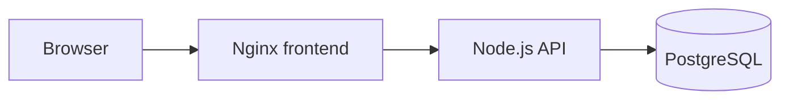

# Platform Hello

`platform-hello` is a small multi-tier hello-world application for the Senior Platform Engineer test.

It keeps the application simple so the platform work can focus on infrastructure as code, pipeline as code, policy as code, and documentation as code.

## Architecture

- `frontend`: static web UI served by Nginx.
- `backend`: Node.js REST API with health, message, and item endpoints.
- `database`: PostgreSQL database with a single `items` table.
- `docker-compose.yml`: local environment that runs all three tiers.



## Run Locally

```bash
docker compose up --build
```

Open:

- Frontend: `http://localhost:8080`
- Backend health: `http://localhost:3000/health`

## Test

```bash
node --test backend/test/app.test.js
```

## API

- `GET /health`: service status.
- `GET /api/message`: hello message.
- `GET /api/items`: list stored items.
- `POST /api/items`: create an item with JSON body `{"name":"example"}`.

## Test Assignment Mapping

- Task 0: this repository provides the multi-tier application codebase.
- Task 1: Terraform can provision VPC, load balancer, compute, database, registry, and environment-specific resources for this app.
- Task 2: CI/CD can build the backend and frontend images, run tests, scan code, and deploy to provisioned environments.
- Task 3: OPA policies can enforce production approvals and secret scanning steps.
- Task 4: architecture and pipeline diagrams can be maintained under `docs/`.
