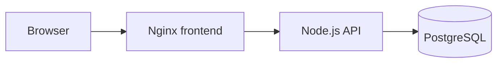

# Platform Hello

`platform-hello` is a small multi-tier hello-world application for the Senior Platform Engineer test.

It keeps the application simple so the platform work can focus on infrastructure as code, pipeline as code, policy as code, and documentation as code.

## Architecture

- `frontend`: static web UI served by Nginx.
- `backend`: Node.js REST API with health, message, and item endpoints.
- `database`: PostgreSQL database with a single `items` table.
- `docker-compose.yml`: local environment that runs all three tiers.



## Run Locally

Create a local `.env` file from `.env.example` and replace `POSTGRES_PASSWORD` with a local random value. Do not commit `.env`.

```bash
cp .env.example .env
docker compose up --build
```

Open:

- Frontend: `http://localhost:8080`
- Backend health: `http://localhost:3000/health`

## Test

```bash
node --test backend/test/app.test.js
```

## API

- `GET /health`: service status.
- `GET /api/message`: hello message.
- `GET /api/items`: list stored items.
- `POST /api/items`: create an item with JSON body `{"name":"example"}`.

## Test Assignment Mapping

- Task 0: this repository provides the multi-tier application codebase.
- Task 1: Terraform provisions AWS VPC, ALB, ECS Fargate, ECR, RDS PostgreSQL, and S3 for five environments.
- Task 2: GitHub Actions runs tests, image builds, Terraform validation, security scanning, policy checks, and gated deployments.
- Task 3: OPA policies enforce staging/production approvals and secret scanning in the pipeline definition.
- Task 4: architecture, infrastructure, pipeline, and policy diagrams are maintained under `docs/architecture`.

## Repository Layout

```text
backend/                 Node.js API
frontend/                Static UI served by Nginx
database/                Local PostgreSQL bootstrap SQL
infra/terraform/         AWS infrastructure as code
policy/opa/              OPA policies and tests
docs/architecture/       Design documentation and diagrams
.github/workflows/      CI/CD pipeline definition
```

## Infrastructure

The Terraform code targets AWS and is split into reusable modules:

- `infra/terraform/modules/network`: VPC, public/private subnets, internet gateway, NAT gateway, and routing.
- `infra/terraform/modules/data`: RDS PostgreSQL and an encrypted S3 bucket.
- `infra/terraform/modules/container-platform`: ECR, ECS Fargate services, ALB, IAM roles, logs, and service security groups.
- `infra/terraform/stacks/platform`: shared environment stack composition.
- `infra/terraform/envs/platform`: single entry point controlled by `environment`.

Example:

```bash
cd infra/terraform/envs/platform
terraform init
terraform plan -var environment=dev
```

AWS credentials are intentionally not committed. Use environment variables or GitHub Actions secrets when running Terraform.

## Policy

OPA policies are under `policy/opa`:

- Secret scanning must exist in the pipeline.
- `staging` and `production` deployment jobs must declare protected GitHub Environments for approval.

## CI/CD

GitHub Actions workflow: `.github/workflows/ci.yml`.

The workflow validates tests, image builds, Terraform configuration, security scanning, and OPA policies before deployment jobs can run.
