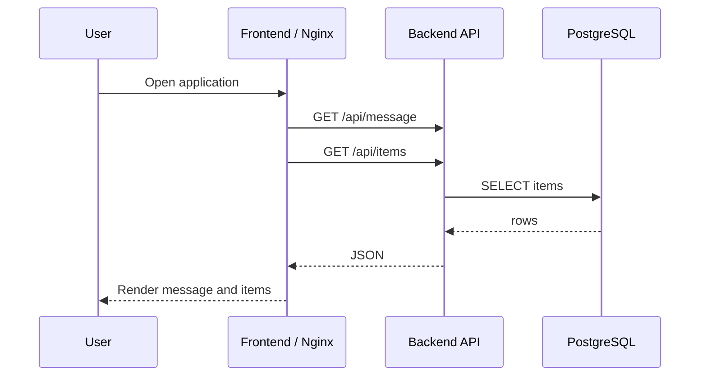

# Task 0 Application Design

## Purpose

This repository contains a compact multi-tier application for the Senior Platform Engineer test. The application is intentionally small, with clear deployment boundaries for infrastructure, CI/CD, and policy automation.

## Components

- Frontend: static HTML, CSS, and JavaScript served by Nginx.
- Backend: Node.js REST API using the built-in HTTP server.
- Database: PostgreSQL storing `items`.

## Request Flow

