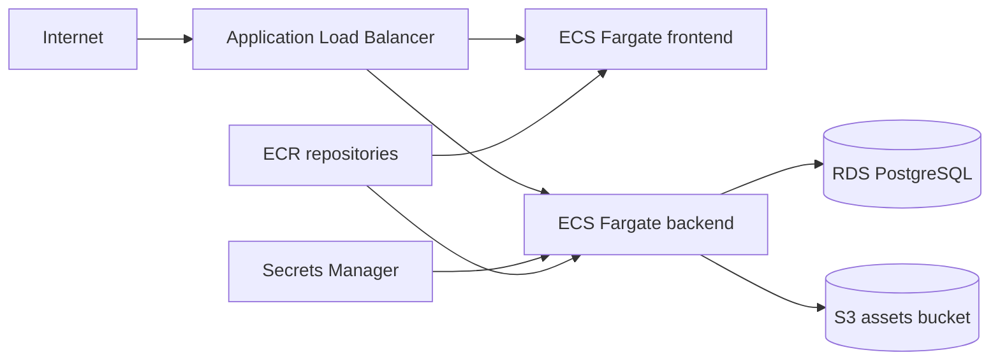

# Task 1 Infrastructure Design

## Overview

The AWS target architecture uses ECS Fargate for compute, RDS PostgreSQL for relational data, Secrets Manager for runtime connection secrets, S3 for object storage, ECR for container images, and an Application Load Balancer as the public entry point.

The Terraform stack exposes environment-specific values as variables. GitHub Actions fills those values through `TF_VAR_*` from GitHub Environment variables during deployment.



## Terraform Layout

The stack uses one root entry point and reusable modules:

- `infra/terraform/envs/platform`: deployment entry point with AWS provider, default tags, and partial S3 backend.
- `infra/terraform/stacks/platform`: environment stack composition and shared naming/tag locals.
- `infra/terraform/modules/network`: VPC, public/private subnets, internet gateway, NAT gateway, route tables, and route table associations.
- `infra/terraform/modules/container-platform`: ECR repositories, ECS cluster, Fargate task definitions and services, ALB, target groups, IAM task execution role, CloudWatch logs, and security groups.
- `infra/terraform/modules/data`: RDS PostgreSQL, generated database password, Secrets Manager database URL, and encrypted assets bucket.
- `infra/terraform/bootstrap/state-backend`: S3 state bucket and DynamoDB lock table bootstrap stack.

## Environment Selection

Run the same root module for every environment. CI/CD is responsible for filling the variable set:

```bash
cd infra/terraform/envs/platform
terraform plan
```

Environment-specific values are not copied across five Terraform directories and are not hard-coded in the Terraform stack. They are supplied by GitHub Actions as `TF_VAR_*`, including environment, AWS region, image URIs, VPC CIDR, availability zones, database name/user/class/version/storage/backup retention, ECS desired count, ECS task CPU/memory, log retention, and deletion protection.

The same GitHub Actions workflow deploys all environments. `workflow_dispatch.inputs.environment` selects the GitHub Environment, and that selected environment provides the deployment variable set.

## Naming And Tags

The stack builds standard names from `platform-hello-<environment>`. Resources with strict AWS length limits, such as ALBs and target groups, use the short prefix `ph-<environment>` while keeping full `Name` tags for readability.

Taggable resources receive common tags from the provider and modules:

- `Application`
- `Environment`
- `ManagedBy`
- `Project`
- Resource-specific `Name`
- Resource-specific `Component`

## Terraform State

Terraform state uses an S3 backend configured at `terraform init` time by CI/CD:

- State bucket: `TF_STATE_BUCKET`
- State key: `platform-hello/<environment>/terraform.tfstate`
- Lock table: `TF_STATE_LOCK_TABLE`
- Encryption: `encrypt=true`

The backend bucket and lock table are provisioned by `infra/terraform/bootstrap/state-backend`. The bucket has versioning, AES256 encryption, public access block, and bucket-owner-enforced object ownership. The DynamoDB lock table uses the `LockID` hash key, server-side encryption, and point-in-time recovery. The bootstrap stack also applies standard Terraform-managed tags.

## Secrets And Credentials

Database credentials are not committed and are not passed as Terraform variables. Terraform generates the database password with the `random` provider and stores the application connection URL in AWS Secrets Manager. ECS injects `DATABASE_URL` from Secrets Manager through the task definition `secrets` block.

AWS credentials are supplied to CI/CD through GitHub OIDC role assumption using `AWS_ROLE_TO_ASSUME`. Long-lived AWS access keys are not part of the design.

## Validation

Infrastructure validation is split into Terraform-native checks and repository standards:

- `terraform fmt -check -recursive` verifies formatting.
- `terraform init -backend=false` validates the platform module without touching remote state.
- `terraform validate` checks Terraform configuration and provider schemas.
- `node scripts/check-terraform-standards.mjs` checks naming and tagging conventions.

## Production Notes

- `staging` and `production` enable RDS deletion protection.
- ECS tasks run in private subnets.
- ALB runs in public subnets.
- RDS is not publicly accessible.
- ECR scan-on-push is enabled.
- S3 public access is blocked and server-side encryption is enabled.
- Database credentials are generated by Terraform and stored in AWS Secrets Manager.
- ECS injects `DATABASE_URL` from Secrets Manager through the task definition `secrets` block, not through plain environment variables.
- All deployment parameters are injected by CI/CD through GitHub Environment variables and secrets.
