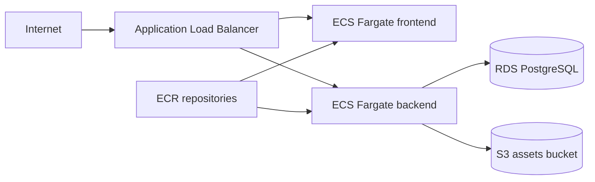

# Task 1 Infrastructure Design

## Overview

The AWS target architecture uses ECS Fargate for compute, RDS PostgreSQL for relational data, S3 for object storage, ECR for container images, and an Application Load Balancer as the public entry point.

The Terraform stack exposes environment-specific values as variables. GitHub Actions fills those values through `TF_VAR_*`, using matrix values during validation and GitHub Environment variables during deployment.



## Environment Selection

Run the same root module for every environment. CI/CD is responsible for filling the variable set:

```bash
cd infra/terraform/envs/platform
terraform plan
```

Environment-specific values are not copied across five Terraform directories and are not hard-coded in the Terraform stack. They are supplied by GitHub Actions as `TF_VAR_environment`, `TF_VAR_vpc_cidr`, `TF_VAR_availability_zones`, `TF_VAR_db_instance_class`, `TF_VAR_desired_count`, and `TF_VAR_deletion_protection`.

## Production Notes

- `staging` and `production` enable RDS deletion protection.
- ECS tasks run in private subnets.
- ALB runs in public subnets.
- RDS is not publicly accessible.
- ECR scan-on-push is enabled.
- S3 public access is blocked and server-side encryption is enabled.
- Database credentials are generated by Terraform and stored in AWS Secrets Manager.
- ECS injects `DATABASE_URL` from Secrets Manager through the task definition `secrets` block, not through plain environment variables.
