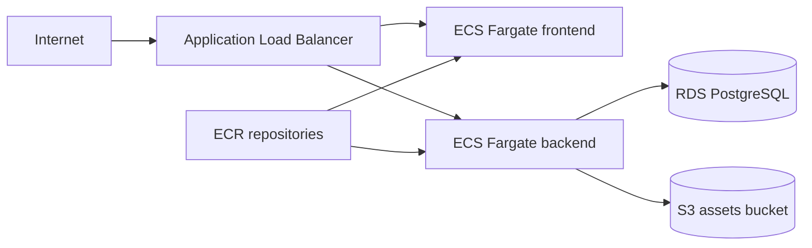

# Task 1 Infrastructure Design

## Overview

The AWS target architecture uses ECS Fargate for compute, RDS PostgreSQL for relational data, S3 for object storage, ECR for container images, and an Application Load Balancer as the public entry point.

The Terraform stack is controlled by a single `environment` parameter. The shared stack maps `dev`, `test`, `perf`, `staging`, and `production` to the correct CIDR range, task count, RDS size, and deletion protection setting.



## Environment Selection

Run the same root module for every environment:

```bash
cd infra/terraform/envs/platform
terraform plan -var environment=dev
terraform plan -var environment=production
```

Environment-specific values are not copied across five directories. They are centralized in `infra/terraform/stacks/platform/main.tf`.

## Production Notes

- `staging` and `production` enable RDS deletion protection.
- ECS tasks run in private subnets.
- ALB runs in public subnets.
- RDS is not publicly accessible.
- ECR scan-on-push is enabled.
- S3 public access is blocked and server-side encryption is enabled.
