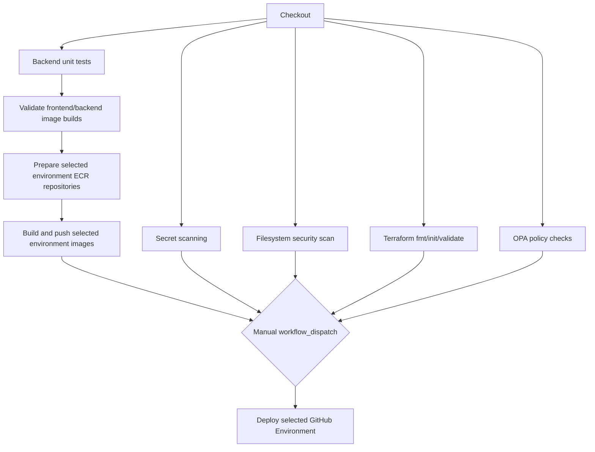

# Task 2 Pipeline Design

## Overview

GitHub Actions is used as the accepted CI/CD platform. The workflow is defined in `.github/workflows/ci.yml`.

## Stages

- `backend-test`: runs Node.js unit tests.
- `secret-scan`: runs Gitleaks to block hard-coded credentials.
- `docker-build`: validates backend and frontend image builds without pushing.
- `prepare-environment`: on manual deployments, uses the selected GitHub Environment and Terraform state to create or confirm the ECR repositories before image push.
- `package-images`: logs in to ECR and pushes backend/frontend images tagged with the commit SHA.
- `security-scan`: runs Trivy filesystem scanning.
- `terraform-validate`: checks Terraform formatting and variable contract without embedding environment values.
- `policy`: runs OPA tests and evaluates the pipeline policy input.
- `deploy`: manual deployment job selected by `workflow_dispatch.inputs.environment`.

## Terraform Parameter Injection

Terraform environment settings are owned by CI/CD, not hard-coded inside Terraform:

- Validation checks Terraform syntax with repository-level CI variables that exercise the same variable contract.
- Deployment uses GitHub Environment variables such as `AWS_REGION`, `VPC_CIDR`, `AVAILABILITY_ZONES_JSON`, `DB_INSTANCE_CLASS`, `DESIRED_COUNT`, `ECS_TASK_CPU`, `ECS_TASK_MEMORY`, `LOG_RETENTION_DAYS`, `DB_ENGINE_VERSION`, `DB_ALLOCATED_STORAGE`, `DB_BACKUP_RETENTION_DAYS`, and `DELETION_PROTECTION`.
- AWS identity and account values are read from GitHub Environment secrets.
- Terraform backend values are read from `TF_STATE_BUCKET` and `TF_STATE_LOCK_TABLE`, then passed to `terraform init` with `encrypt=true` and an environment-specific state key.

## Approval Model

The `deploy-staging` and `deploy-production` jobs declare GitHub Environments named `staging` and `production`. In a real repository, those environments should require reviewers in repository settings so GitHub blocks the deployment until approval is granted.
