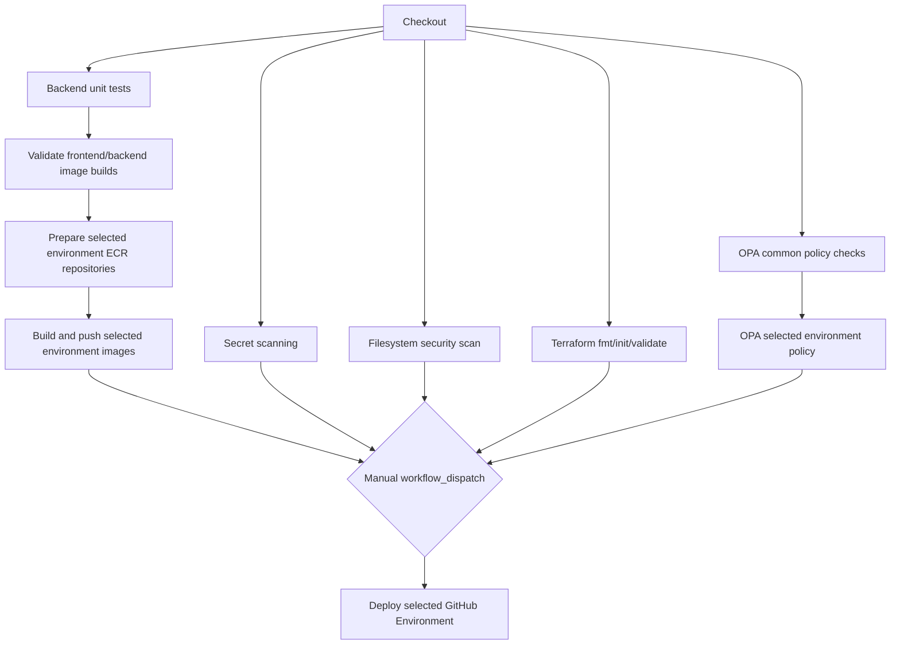

# Task 2 Pipeline Design

## Overview

GitHub Actions is used as the accepted CI/CD platform. The workflow is defined in `.github/workflows/ci.yml`.

## Stages

- `backend-test`: runs Node.js unit tests.
- `secret-scan`: runs Gitleaks to block hard-coded credentials.
- `docker-build`: validates backend and frontend image builds without pushing.
- `prepare-environment`: on manual deployments, uses the selected GitHub Environment and Terraform state to create or confirm the ECR repositories before image push.
- `package-images`: logs in to ECR and pushes backend/frontend images tagged with the commit SHA.
- `security-scan`: runs Trivy filesystem scanning.
- `terraform-validate`: checks Terraform formatting, naming/tagging standards, and variable contract without embedding environment values.
- `policy-common`: runs common OPA tests and evaluates enterprise CI/CD baseline controls.
- `policy-environment`: on manual deployments, loads only the selected environment's OPA policy and input.
- `deploy`: manual deployment job selected by `workflow_dispatch.inputs.environment`.

## CI/CD Security Baseline

- Workflow-level permissions are read-only; AWS OIDC is granted only on jobs that assume AWS roles.
- Checkout disables persisted Git credentials.
- Jobs have explicit timeouts.
- Workflow concurrency serializes runs by selected environment for manual deployments.
- Deployment jobs must pass common policy checks and the selected environment policy before touching AWS.
- AWS credentials are obtained through `aws-actions/configure-aws-credentials` with GitHub OIDC and `AWS_ROLE_TO_ASSUME`.
- Terraform deploy commands run with `-input=false` so deployments are non-interactive and reproducible.

## Deployment Flow

Manual deployment starts with `workflow_dispatch.inputs.environment`. The selected value must be one of `dev`, `test`, `perf`, `staging`, or `production`.

1. CI jobs run backend tests, secret scanning, filesystem scanning, container image validation builds, Terraform validation, and OPA common policy checks.
2. `policy-environment` loads only `policy/opa/environments/<selected>` and `policy/input/environments/<selected>.json`.
3. `prepare-environment` assumes the selected environment's AWS role and applies only the ECR repository targets so image push has a managed destination.
4. `package-images` builds and pushes backend/frontend images to environment-scoped ECR repositories with the commit SHA tag.
5. `deploy` initializes the S3 backend with the selected environment state key, creates a Terraform plan, and applies that exact plan.

`staging` and `production` rely on GitHub Environment protection rules for human approval. The workflow declares the selected GitHub Environment on policy, packaging, preparation, and deployment jobs.

## Terraform Parameter Injection

Terraform environment settings are owned by CI/CD, not hard-coded inside Terraform:

- Validation checks Terraform syntax with repository-level CI variables that exercise the same variable contract.
- Deployment uses GitHub Environment variables such as `AWS_REGION`, `VPC_CIDR`, `AVAILABILITY_ZONES_JSON`, `DB_INSTANCE_CLASS`, `DESIRED_COUNT`, `ECS_TASK_CPU`, `ECS_TASK_MEMORY`, `LOG_RETENTION_DAYS`, `DB_ENGINE_VERSION`, `DB_ALLOCATED_STORAGE`, `DB_BACKUP_RETENTION_DAYS`, and `DELETION_PROTECTION`.
- AWS identity and account values are read from GitHub Environment secrets.
- Terraform backend values are read from `TF_STATE_BUCKET` and `TF_STATE_LOCK_TABLE`, then passed to `terraform init` with `encrypt=true` and an environment-specific state key.

## Required Configuration

Each GitHub Environment provides:

- Variables: `AWS_REGION`, `VPC_CIDR`, `AVAILABILITY_ZONES_JSON`, `DB_NAME`, `DB_USERNAME`, `DB_INSTANCE_CLASS`, `DESIRED_COUNT`, `DELETION_PROTECTION`, `ECS_TASK_CPU`, `ECS_TASK_MEMORY`, `LOG_RETENTION_DAYS`, `DB_ENGINE_VERSION`, `DB_ALLOCATED_STORAGE`, `DB_BACKUP_RETENTION_DAYS`, `TF_STATE_BUCKET`, and `TF_STATE_LOCK_TABLE`.
- Secrets: `AWS_ACCOUNT_ID` and `AWS_ROLE_TO_ASSUME`.

Repository-level validation variables use the `TF_VALIDATE_*` prefix and provide a non-secret Terraform variable set for `terraform validate`.

## Approval Model

The `deploy` job declares the selected GitHub Environment from `workflow_dispatch.inputs.environment`. In a real repository, staging and production environments should require reviewers in repository settings so GitHub blocks those deployments until approval is granted.
