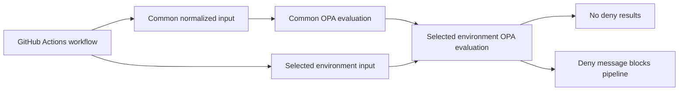

# Task 3 Policy as Code

## Overview

OPA policies live under `policy/opa` and normalized policy inputs live under `policy/input`. Policy is split into a common enterprise baseline plus environment-specific deployment gates.

- `policy/opa/common`: checks secret scanning, ECR image publishing, environment policy dependencies, GitHub Environment declarations, read-only workflow permissions, and job-level AWS OIDC.
- `policy/opa/environments/dev`: accepts only dev deployments.
- `policy/opa/environments/test`: requires test deployments to depend on security scanning.
- `policy/opa/environments/perf`: requires backend and frontend images to be built for performance deployments.
- `policy/opa/environments/staging`: requires the selected GitHub Environment gate before staging deploys.
- `policy/opa/environments/production`: requires production-only input, the selected GitHub Environment gate, OIDC, and Terraform plan before apply.

## Policy Flow



## Local Commands

If OPA is installed:

```bash
opa test policy/opa
opa eval --data policy/opa/common --input policy/input/github_actions.json "data.platform.common.deny"
opa eval --data policy/opa/environments/production --input policy/input/environments/production.json "data.platform.environments.production.deny"
```

## Required GitHub Settings

Configure these GitHub Environments:

- `staging`: require one or more reviewers.
- `production`: require one or more reviewers.

The workflow selects one of those environments from `workflow_dispatch.inputs.environment`; repository settings enforce the human approval gate.
