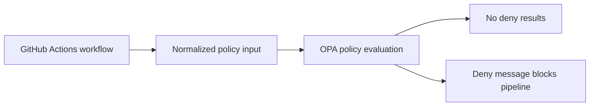

# Task 3 Policy as Code

## Overview

OPA policies live under `policy/opa`. They enforce two required controls:

- The pipeline must include secret scanning.
- Staging and production deployment jobs must declare protected GitHub Environments.
- Runtime credentials must be provided by platform secret stores such as GitHub Actions secrets, local `.env` files ignored by Git, or AWS Secrets Manager.

## Policy Flow



## Local Commands

If OPA is installed:

```bash
opa test policy/opa
opa eval --data policy/opa --input policy/opa/input/github_actions.json "data.platform.pipeline.deny"
```

## Required GitHub Settings

Configure these GitHub Environments:

- `staging`: require one or more reviewers.
- `production`: require one or more reviewers.

The workflow declares those environments; repository settings enforce the human approval gate.
