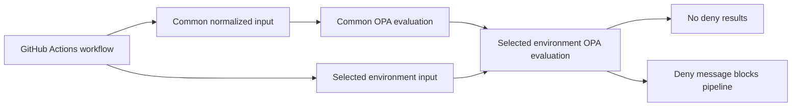

# Task 3 Policy as Code

## Overview

OPA policies live under `policy/opa` and normalized policy inputs live under `policy/input`. Policy is split into a common enterprise baseline plus environment-specific deployment gates.

- `policy/opa/common`: checks secret scanning, ECR image publishing, environment policy dependencies, GitHub Environment declarations, read-only workflow permissions, and job-level AWS OIDC.
- `policy/opa/environments/dev`: accepts only dev deployments.
- `policy/opa/environments/test`: requires test deployments to depend on security scanning.
- `policy/opa/environments/perf`: requires backend and frontend images to be built for performance deployments.
- `policy/opa/environments/staging`: requires the selected GitHub Environment gate before staging deploys.
- `policy/opa/environments/production`: requires production-only input, the selected GitHub Environment gate, OIDC, and Terraform plan before apply.

## Policy Directory Layout

```text
policy/
  input/
    github_actions.json
    environments/
      dev.json
      test.json
      perf.json
      staging.json
      production.json
  opa/
    common/
      workflow.rego
      workflow_test.rego
    environments/
      dev/
      test/
      perf/
      staging/
      production/
```

`policy/input` files are examples of the normalized workflow facts evaluated in CI. They are intentionally outside `policy/opa` so `opa test policy/opa` loads only Rego policy and test files.

## Policy Flow



## Common Policy Rules

The common policy applies to every environment:

- Workflow-level `contents` permission must be read-only.
- Workflow-level `id-token: write` is denied; OIDC is allowed only on jobs that assume AWS roles.
- AWS credential jobs must declare job-level `id-token: write`.
- Checkout steps must set `persist-credentials: false`.
- Jobs must declare `timeout-minutes`.
- Secret scanning must exist.
- Environment-scoped image publishing to ECR must exist.
- Deployment and environment preparation must depend on the selected environment policy gate.
- The environment policy gate must depend on the common policy gate.
- Deploy must declare a GitHub Environment.

## Environment Policy Rules

| Environment | Additional Rules |
| --- | --- |
| `dev` | Only evaluates `dev` deployment input. |
| `test` | Requires deployment to depend on `security-scan`. |
| `perf` | Requires backend and frontend image builds and deployment dependency on `security-scan`. |
| `staging` | Requires the selected GitHub Environment gate before deployment. |
| `production` | Requires production-only input, selected GitHub Environment gate, job-level OIDC, and Terraform `plan` before `apply`. |

## Local Commands

If OPA is installed:

```bash
opa test policy/opa
opa eval --data policy/opa/common --input policy/input/github_actions.json "data.platform.common.deny"
opa eval --data policy/opa/environments/production --input policy/input/environments/production.json "data.platform.environments.production.deny"
```

For all environment inputs:

```bash
for env in dev test perf staging production; do
  opa eval --format raw \
    --data "policy/opa/environments/${env}" \
    --input "policy/input/environments/${env}.json" \
    "count(data.platform.environments.${env}.deny)"
done
```

## Required GitHub Settings

Configure these GitHub Environments:

- `staging`: require one or more reviewers.
- `production`: require one or more reviewers.

The workflow selects one of those environments from `workflow_dispatch.inputs.environment`; repository settings enforce the human approval gate.
